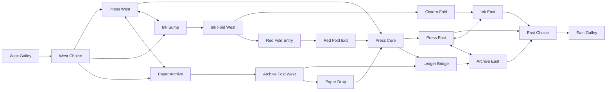

# Inkfall Foundry original arena graybox brief

- Status: **DESIGN SEED ONLY - P6.1 PREWORK**
- Date: 2026-07-20 (America/Chicago)
- Map ID: `inkfall_foundry`
- Layout seed: `assets/source/maps/inkfall-foundry/inkfall-foundry.layout-seed.v1.json`
- Gate claim: **none**. G5 and G6 remain open.
- Runtime impact: none; no loader, render mesh, collider package, spawn system, or map route was changed.

## Truth boundary

This brief prepares an independently authored topology and measurable hypotheses for the ordered Phase 6 map lane. It does not move Phase 6 ahead of unfinished runtime gates: Phase 4/G3 and Phase 5/G4 still own integration order. No Blender graybox, render export, authoritative collider, map package, LOS raycast, movement tape, playtest, final-art room, or performance capture exists yet.

The accepted Phase 3 baseline is used only as a sizing ruler. Its profile remains `phase3_hypothesis_v1` revision 1, hash `8ab4ed437a4393c0`, evidence label `HYPOTHESIS`, implementation status `fixture_only`, and canonical movement hash `66fcaf19c3fd94ad`. Human G2 acceptance did not promote those numbers to final balance or prove them on a real arena.

## Originality statement

Inkfall Foundry uses an original three-tier S-fold around a split print reactor. The geometry, node graph, spawn pockets, cross-links, and landmark arrangement were authored from abstract route and combat requirements. They do not trace or reconstruct Rook, Dragon Temple, Graveyard, or any other reference map. Those names appear only in the explicit do-not-copy constraint.

Working visual premise: pale ceramic industrial masses frame deep ink maintenance channels; vermilion marks the single teleport fold; suspended paper-like baffles create the upper archive silhouette; one broken garden conduit identifies the one-way drop. The working name and fiction may change without changing the topology contract.

## Spatial envelope

| Item | Seed | Status |
|---|---:|---|
| Overall bounds | 72 m east-west x 56 m north-south x 15 m vertical | HYPOTHESIS |
| Ink Channel floor | -3.0 m | HYPOTHESIS |
| Press Hall floor | 0.0 m | HYPOTHESIS |
| Archive Walk floor | +6.0 m | HYPOTHESIS |
| Primary grid | 1.0 m; 0.25 m documented fine adjustment | design rule |
| Intended occupancy | 4-8, with 2-player test mode | specification target |

## Topology

Three route families share junctions rather than acting as isolated lanes:

1. **Press Hall** - fastest midrange path through offset baffles and the split reactor. It is high-risk, but no single straight ray owns the crossing.
2. **Ink Channel** - lower close-range route with a slide/crouch bypass, recoverable displacement edges, and two rises back to mid.
3. **Archive Walk** - exposed upper route with a deliberate 44 m long-angle exception, three approaches to its strongest bridge, and a one-way drop.

Per side, Press has a lower Ink link and an upper Archive link. Press Core also reaches Ledger Bridge by switchback; west Archive can commit to Paper Drop; Ink Fold can spend teleport to reach an exposed Press landing. No strong position has fewer than three topology approaches in the seed.

## Movement sizing from the accepted Phase 3 profile

| Constraint | Profile fact | Graybox seed | Margin / reason |
|---|---:|---:|---|
| Standing capsule | 1.80 m high, 0.35 m radius | standing clearance >=2.40 m | >=0.58 m above body plus 0.02 m skin |
| Crouched capsule | 1.10 m high, 0.35 m radius | slide gate 1.35 m high x 1.40 m wide | 0.23 m height margin; crouch fallback remains valid |
| Door fixture | 0.70 m rejects; 0.80 m passes | flank door 1.40 m; main door 2.40 m | deliberate combat and latency margin |
| Step controller | 0.35 m maximum; 0.40 m minimum tread | <=0.25 m rise; >=0.50 m run | 0.10 m rise margin |
| Slope controller | 45-degree climb ceiling | ordinary ramps <=20 degrees | avoids threshold-level authored routes |
| Jump | 2.75 m apex gain; 1.00 s airtime; 8 m/s air cap | mandatory gap <=4.20 m; optional skill gap 5.20 m | walk-around required; real map tape pending |
| Slide | 0.60 s useful duration; 7-10 m/s | restricted segment 4.80 m after 8 m run-in | targets usefulness without making slide mandatory |
| Teleport | 9.00 m maximum | shortcut 8.124 m, 4.0 m landing diameter | 0.876 m cast-range margin; destination tape pending |

These are clearance and traversal hypotheses. Decorative bevels cannot define authoritative collision, and no mandatory route may depend on an unproved maximum jump or teleport edge.

## Calculated route seed

The calculation uses the sealed 60 m/s^2 ground acceleration and 9 m/s sprint speed. From rest, acceleration lasts 150 ms and covers 675 mm; afterward distance is divided by 9 m/s. A rolling loop uses distance divided by 9 m/s. Every turn, elevation, stance, visibility, or interaction allowance is an explicit penalty in the JSON. These are not measured route tapes.

| Scenario | Geometry distance (m) | Estimated time (s) | Target band (s) | Explicit allowance |
|---|---:|---:|---:|---|
| West spawn to first route choice | 11.180 | 1.517 | 1.0-2.5 | one protected spawn bend |
| East spawn to first route choice | 11.180 | 1.517 | 1.0-2.5 | one protected spawn bend |
| West spawn to Press Core probable contact | 39.676 | 4.933 | 4.0-9.0 | three baffle turns and one shoulder check |
| East spawn to Press Core probable contact | 42.287 | 5.224 | 4.0-9.0 | three baffle turns and one shoulder check |
| West spawn to west Ink Fold probable contact | 45.009 | 5.976 | 4.0-9.0 | descent switchback, close cover, and stance-choice allowance |
| East spawn to east Ink Fold probable contact | 45.554 | 6.037 | 4.0-9.0 | descent switchback, close cover, and stance-choice allowance |
| West spawn to west Archive Fold probable contact | 46.372 | 6.577 | 4.0-9.0 | six-meter switchback rise, exposure checks, and two direction changes |
| East spawn to east Archive Fold probable contact | 47.904 | 6.748 | 4.0-9.0 | six-meter switchback rise, exposure checks, and two direction changes |
| Fast Press Hall crossing | 40.429 | 5.217 | 4.0-7.0 | offset baffles prevent one uninterrupted lethal line |
| Archive-to-Ink full outer loop | 176.611 | 22.723 | 15.0-28.0 | two six-meter tier changes, eight major bends, cover checks, and stance choices |
| Ink Fold teleport flank to Press Core | 26.401 | 2.556 | 1.8-4.0 | slide/crouch choice, destination read, and one authority tick for activation hypothesis |
| Archive Fold drop flank to Press Core | 24.699 | 3.619 | 2.5-5.0 | one-way drop commitment, landing recovery, and angle check |

All twelve calculated estimates land inside their specification or design bands. That only validates arithmetic coherence; Phase 6 must replace them with repeated 20 Hz authoritative tapes on the real collider.

## Sightline and cover hypotheses

| Probe | Full probe | Planned uninterrupted segment | Design intent |
|---|---:|---:|---|
| Press diagonal | 37.947 m | <=18 m between baffles | broken midrange contest |
| Archive long exception | 44.000 m | 44 m exception | shooter exposed to at least two named counter-routes |
| Ink bend | 30.067 m | <=16 m between bends | close-range flank |
| West spawn exit | 19.105 m test ray | 0 direct LOS | hard occluder before route choice |

Ordinary uncovered travel targets <=12 m. The seed cover mix is 35% full, 40% half, and 25% low/permeable, all pending layout review. Cover must leave projectile splash and crossfire counterplay; it cannot form one-angle spawn containment.

## Spawn plan

The JSON seeds eight team-gallery candidates and four deathmatch candidates. Every candidate has at least two named escape families and targets zero direct enemy LOS at selection. **None has been raycast or scored.** At runtime, the authority must re-evaluate enemy distance/LOS/aim, travel time, recent death, teammate clustering, pressure, occupancy, escape count, recent use, and mode territory. A client never selects an accepted spawn transform.

Required first spawn fixtures:

- all candidate-to-all-enemy LOS sweep at standing and crouched eye hypotheses;
- two-player repeated respawn with one enemy camping each exit in turn;
- 4- and 8-player occupancy with recent-use and teammate-cluster pressure;
- deterministic score-component visualization and stable tie-break;
- teleport/drop arrival included in nearby-enemy travel-time probes.

## Strong-position counters

| Position | Seed access count | Required counters |
|---|---:|---|
| Ledger Bridge | 3 | west/east Archive pressure, Press switchback, Paper Drop flank, Red Fold destination pressure |
| Press Core | 4 | both Press shoulders, teleport landing, Paper Drop, lower/upper crossfire |
| Ink Fold | 3 | both channel directions, Press rise, teleport commitment |

Access counts are graph facts, not combat proof. G5 still requires LOS, traversal, spawn, and playtest evidence showing the counters work.

## Navigation language

Nine callouts carry distinct silhouettes and grayscale value families: West Galley, East Galley, Press Hall, Ink Sump, Cistern Fold, Paper Archive, Ledger Bridge, Red Fold, and Paper Drop. Functional floor/wall markings indicate route tier, hazard, or interaction. No fake glyphs or random Japanese characters are permitted. Accent color confirms meaning; it never carries the only cue.

## Graybox and collision production rules

- Build on a meter grid in Blender, with clean integer-millimeter authoritative proxies.
- Export render and collision separately. The server package never loads render geometry.
- Use simple boxes, ramps, and purpose-built convex proxies; no decorative bevel or unrestricted visual triangle mesh becomes authority.
- Keep primary routes >=2.2 m wide, ordinary standing clearance >=2.4 m, flank doors >=1.4 m, and main doors 2.4 m.
- Reserve kill volumes for legible outer boundaries. Ink displacement areas receive marked recovery exits.
- Teleport receives an 8.124 m cast route, a 4 m landing area, and counter-sightlines. It is optional; a non-ability route remains.
- Every one-way drop must have a safe landing fixture and a separately timed return route.
- Map geometry is static authored data. Runtime random construction is prohibited.

## Telemetry and evidence plan

Instrument zone transitions, route IDs, traversal time, deaths, damage, spawn choice/score components, sightline exposure, teleport outcomes, slide/crouch choice, out-of-bounds recovery, and occupancy. Test 2/4/8 players before topology lock.

The eventual Phase 6 evidence root must record commit/dirty state, map/profile/hash, seed, players/bots, browser/viewport/machine tier, exact reproduction command, route tapes, spawn/LOS fixtures, screenshots/video, profiles, and known issues. A screenshot or green build alone cannot pass G5.

## Performance seed

The 72 x 56 m envelope is divided into a provisional 3 x 3 cell grid, approximately 24 x 19 m per cell, with adjacent-cell loading. The graybox must be measured against the existing vertical-slice budgets: <500 baseline combat draw calls (strive <350), <300 low; <1.5M baseline visible triangles, <700k low; frame p95 <=16.67 ms; baseline main-thread p95 <=10 ms; baseline GPU p95 <=12 ms; no recurring >50 ms long tasks. These are target budgets, not results.

Required captures later: empty overview, two-player duel, eight visible characters, rapid cell traversal, respawn churn, low/high switch, and 30-minute soak. Map unload must release GL resources and listeners.

## Ordered Phase 6 status

| Backlog item | Prepared here | Still required |
|---|---|---|
| P6.1 topology/callouts/route metrics | Original graph, callouts, arithmetic seed | review, authoritative route tapes, topology approval |
| P6.2 Blender graybox/collider | dimensions and proxy rules only | source blend, render graybox, separate collider export |
| P6.3 package/schema/volumes | planned paths and semantic fields only | strict schema, loader, spawns/pickups/zones/kill/recovery data |
| P6.4 spawn scoring | score inputs and candidate seeds | implementation, fixtures, debug visualization |
| P6.5 telemetry | event/metric list | runtime instrumentation and reports |
| P6.6 playtest | protocol outlined | 2/4/8-player sessions and revisions |
| P6.7 topology lock | not started | measured approval and art-kit dimensions |

## G5/G6 non-claim

G5 is not assessed: there is no loading map package, separate collision artifact, route/spawn/sightline measurement, snag/escape sweep, graybox playtest, or final-art room. G6 is unrelated and remains open. The first final-art room belongs to Phase 7 after the graybox topology is measured and locked.

## Source anchors

- Archived project handoff: map design, performance budgets, QA evidence gates,
  and execution backlog documents (not part of this repository)
- `src/sim/movement/profile.ts` and sealed `evidence/2026-07-20/phase-3-movement-collision/movement-tapes.json`
- `docs/adr/ADR-003-character-controller-and-collision-queries.md`

